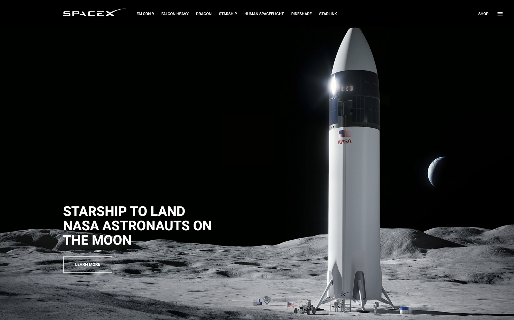

<!-- PROJECT LOGO -->
<br />
<div align="center">
  <a href="https://github.com/dinardavis/spacex_clone">
    
  </a>

<h3 align="center">SpaceX Landing Page Clone</h3>

  <p align="center">
    The goal of this project was to create a landing page clone as true to the actual website as possible. My clone is fully responsive, and includes links to the corporate site, offering a complete and seamless user experience.
    <br />
    <br />
    <a href="https://github.com/dinardavis/spacex_clone"><strong>Explore the docs »</strong></a>
    <br />
    <br />
    <a href="https://dinardavis.github.io/spacex_clone/">View Demo</a>
    ·
    <a href="https://github.com/dinardavis/spacex_clone/issues">Report Bug</a>
    ·
    <a href="https://github.com/dinardavis/spacex_clone/issues">Request Feature</a>
  </p>
</div>


<!-- TABLE OF CONTENTS -->
<details>
  <summary>Table of Contents</summary>
  <ol>
    <li>
      <a href="#about-the-project">About The Project</a>
      <ul>
        <li><a href="#built-with">Built With</a></li>
      </ul>
    </li>
    <li>
      <a href="#getting-started">Getting Started</a>
      <ul>
        <li><a href="#tools">Tools</a></li>
        <li><a href="#setup">Setup</a></li>
      </ul>
    </li>
    <li><a href="#contributing">Contributing</a></li>
    <li><a href="#contact">Contact</a></li>
  </ol>
</details>


<!-- ABOUT THE PROJECT -->
## About The Project

<br />

<div align="center">
  
</div>

<br />

<p align="right">(<a href="#readme-top">back to top</a>)</p>


### Built With

*  
* 
* 

<p align="right">(<a href="#readme-top">back to top</a>)</p>


<!-- GETTING STARTED -->
## Getting Started

## Tools

* [git](https://git-scm.com/downloads): A tool for managing source code
* [Visual Studio Code](https://code.visualstudio.com/): A source code editor

## Setup

With git clone the code to your machine, or download a ZIP of all the files directly.

[Download the ZIP from this location](https://github.com/dinardavis/spacex_clone), or run the following command to clone the files to your machine:

```bash
git clone https://github.com/dinardavis/spacex_clone
```
* Once the files are on your machine, open the _spacex_clone_ folder in [Visual Studio Code](https://code.visualstudio.com/).

* With the files open in Visual Studio Code, press the **Go Live** button at the bottom of the window to launch the files with [Live Server](https://marketplace.visualstudio.com/items?itemName=ritwickdey.LiveServer).

<p align="right">(<a href="#readme-top">back to top</a>)</p>


<!-- CONTRIBUTING -->
## Contributing

In building this project one of the things that stood out to me was that apparently SpaceX launches rockets like every other day! So keeping my site up-to-date was made that much more challenging. :sweat_smile: With that in mind if you notice that the launch images aren't quite up to date, or you want to make any other contributions feel free!

Also, if you have a suggestion that would make this project better, please fork the repo and create a pull request. You can also simply open an issue with the tag "enhancement".
If you like the project, a star would be much appreciated! Thanks again!

1. Fork the Project
2. Create your Feature Branch (`git checkout -b feature/NewFeature`)
3. Commit your Changes (`git commit -m 'Add some NewFeature'`)
4. Push to the Branch (`git push origin feature/NewFeature`)
5. Open a Pull Request

<p align="right">(<a href="#readme-top">back to top</a>)</p>


<!-- CONTACT -->
## Contact

 <a href="https://www.linkedin.com/in/dinardavis/">
    
  </a>
  <a href="https://twitter.com/dinardavis">
    
  </a>

Project Link: [https://github.com/dinardavis/spacex_clone](https://github.com/dinardavis/spacex_clone)

<p align="right">(<a href="#readme-top">back to top</a>)</p>
